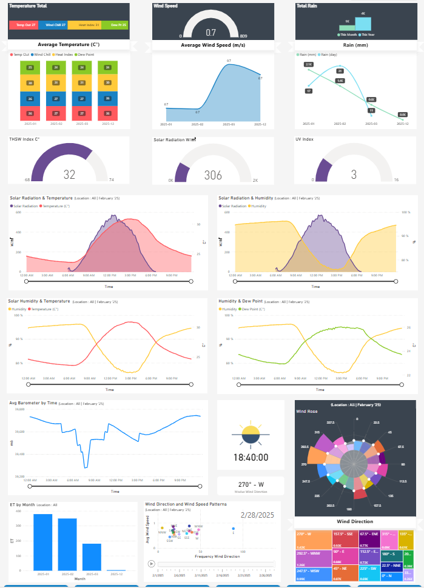
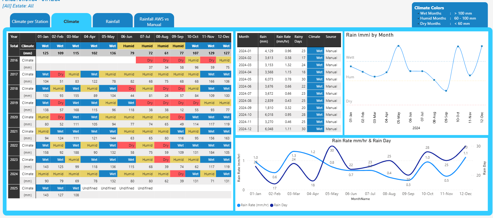

# 📊 PBI Dashboard - Weather Monitoring Dashboard

Dashboard ini dirancang untuk menyajikan informasi cuaca harian secara komprehensif dan interaktif, guna mendukung pengambilan keputusan berbasis data di berbagai sektor seperti pertanian, energi terbarukan, mitigasi bencana, dan operasional lapangan.

## 🎯 Objective
Dashboard ini berfungsi sebagai pusat pemantauan kondisi atmosfer, dengan visual yang memudahkan pengguna memahami perubahan cuaca dan potensi dampaknya terhadap lingkungan maupun kegiatan operasional.
Visualisasi ini menampilkan:

## 🛠 Tools Used
- PBI Desktop
- Davis Weather Station
- Excel Data Source
- batchfile (automatic sync data)

## 📌 Key Features
- Suhu rata-rata harian, angin, dan curah hujan
- Indeks radiasi matahari, UV, serta tingkat kelembaban & tekanan udara
- Pola harian dari suhu, kelembaban, radiasi, dan angin dalam bentuk grafik waktu nyata
- Arah dan kecepatan angin dalam format wind rose dan tren bulanan
- Waktu dan posisi matahari, termasuk estimasi evapotranspirasi bulanan (ET)
- Navigasi interaktif berdasarkan tahun, bulan, dan lokasi stasiun cuaca

  
## 🖼️ Preview

